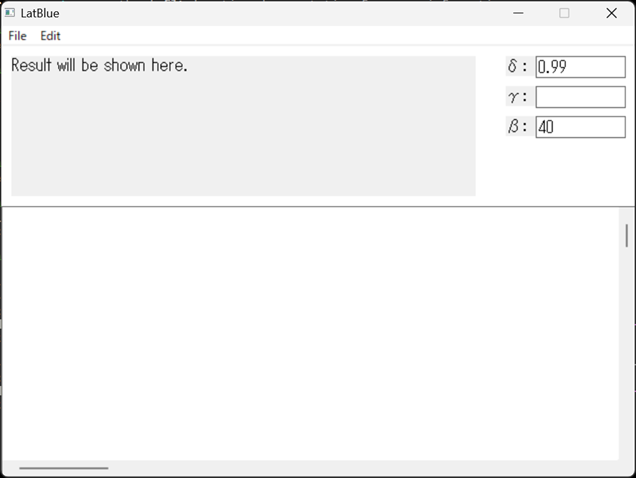
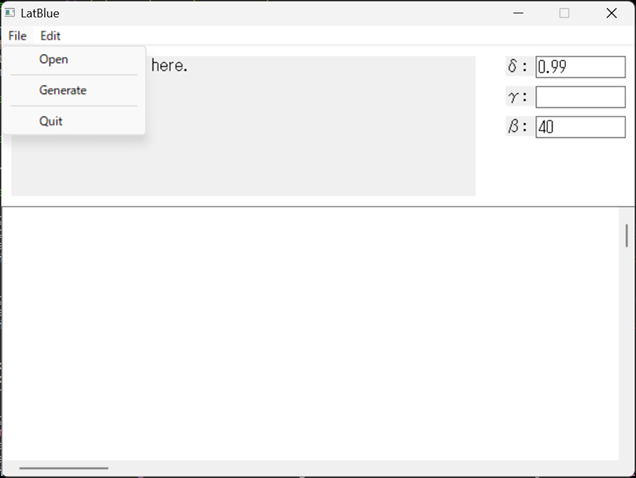
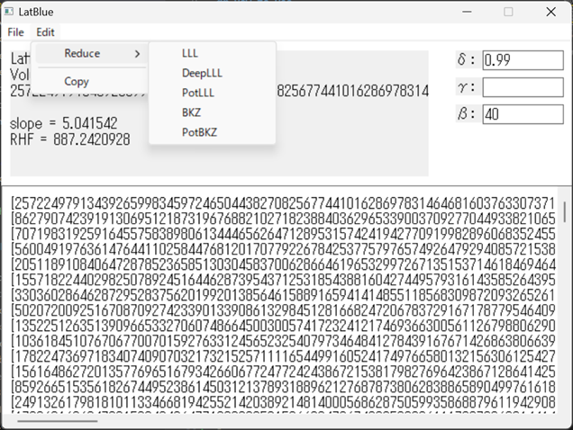

# LatBlue

A windows software for lattice basis reduction

## How to Install

You can get the software from this GitHub or other download website(it is now under preparation because the software is under developing). If you download zip file named ``LatBlue.zip`` or ``LatBlue_beta.zip``, you can use LatBlue without installation (for example executing ``setup.exe`` etc.).

## How to Use

If you download the zip file, you have to expand the zip file. If you expanded the zip file, there is ``LatBlue.exe`` in the expanded folder. By executing ``LatBlue.exe``, you can use.



The above is a screen-shot of LatBlue. I descript the three parameters δ, γ, and β.

- δ: a reduction parameter for Lovász condition or deep-exchange condition. This must be in range (0.25, 1.0), and if you input the value out of the range, it is rounded in (0.25, 1.0).
- γ: a reduction parameter for deep-insertion. This must be integer in range (2, [lattice rank]).
- β: a block-size for BKZ-type reduction. This must be integer in range (2, [lattice rank]).



If you select "File>Open", you can set lattice basis from txt file. The txt file format have to follow the follows.

```shell
[lattice rank]
b_{1, 1} b_{1, 2} ... b_{1, [lattice rank]}
b_{2, 1} b_{2, 2} ... b_{2, [lattice rank]}
...      ...      ... ...
b_{[lattice rank], 1} b_{[lattice rank], 2} ... b_{[lattice rank], [lattice rank]}
```

for example

```shell
3
100 0 0
101 1 0
99 0 1
```

If you select "File>Generate", you can generate a random Goldstein-Mayar lattice basis. You can get the original source codes for generation is in [SVP-challenge website](https://www.latticechallenge.org/svp-challenge/).



If you select "Edit>Reduce", you can choose lattice reduction algorithms from LLL, DeepLLL, PotLLL, BKZ, and PotBKZ now. It will be updated.

If you select "Edit>Copy", you can copy lattice basis to clipboard.
